# Frequently made mistakes

## 1.1 Determine the normal force in bar $\rm{CD}$ and $\rm{AC}$

```{figure} ./FMM_data/1.1.svg
:align: center
```

### No free-body diagrams

### 'Incorrect' free-body diagrams

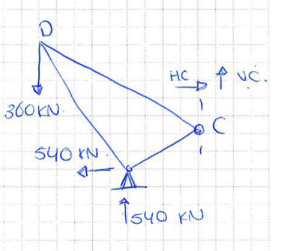

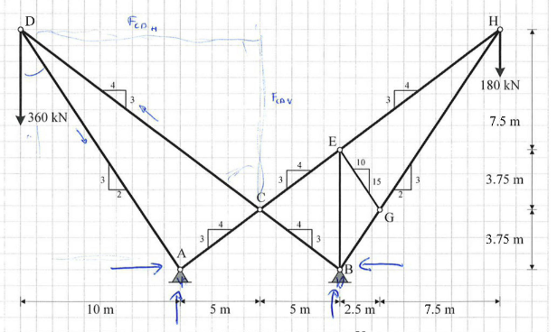

### Missing forces in free-body diagrams

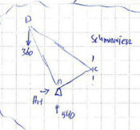

### Incorrect free-body diagrams

### Resultant / Equilibrium

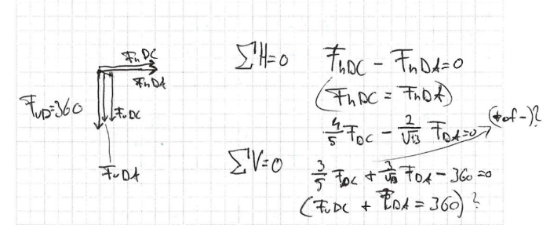

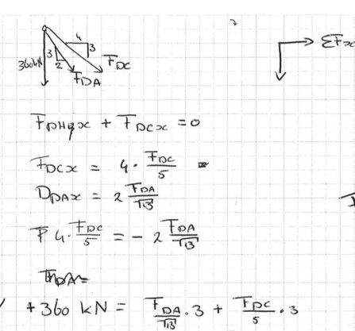

### Missing equilibrium equations

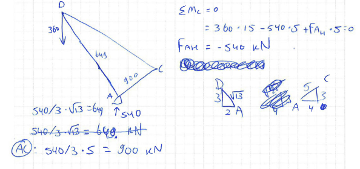

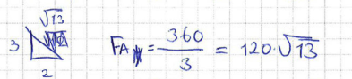

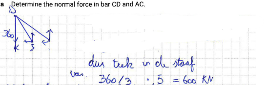

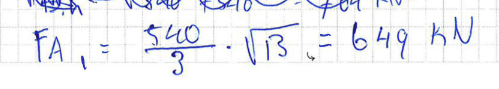

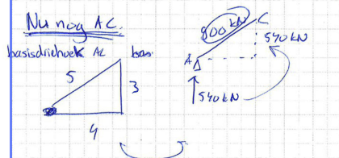

## 1.2 Determine the displacement of node $\rm{C}$

### Trying to use forget-me-nots

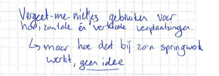

### Incorrectly calculated resultant displacement

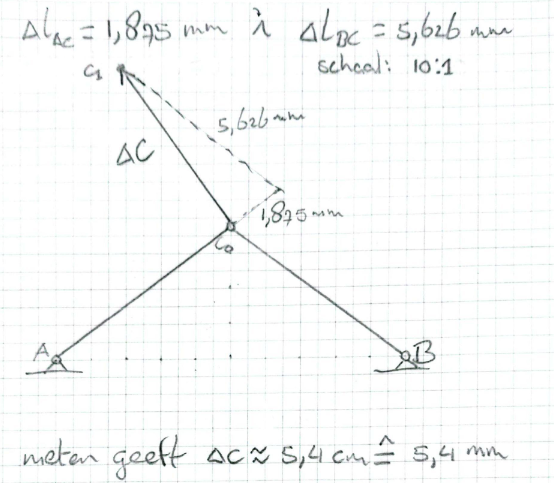

## 2.1 Determinate the support reaction at $\rm{D}$

```{figure} ./FMM_data/2.1.svg
:align: center
```

### FBD and supports

Similar to 1.1

### Incorrect FBD of part of structure

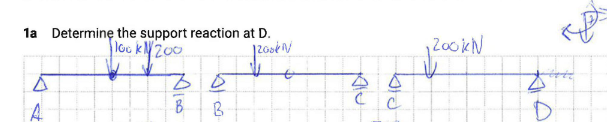

### Starting with V-line

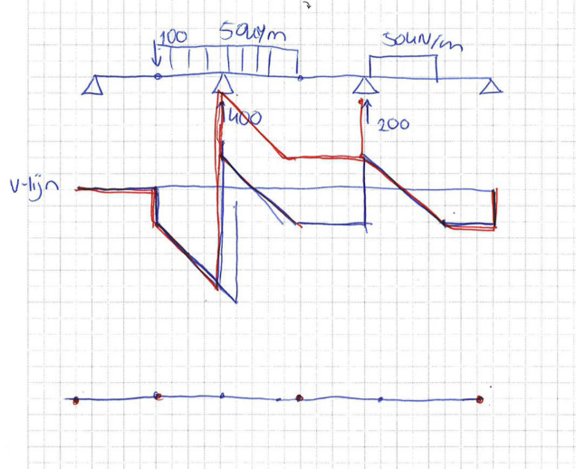

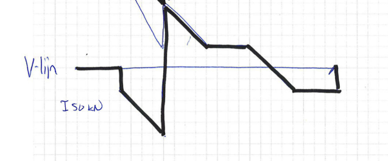

## 2.2 Determinate the bending moment in $\rm{C}$ using virtual work

### No virtual work

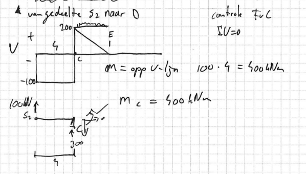

## 2.3 Draw the bending moment diagram

### Bending moment diagram doesn't match loads

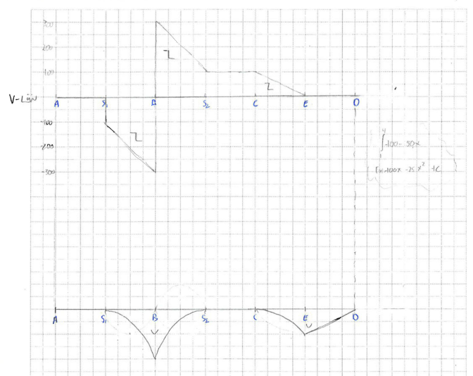

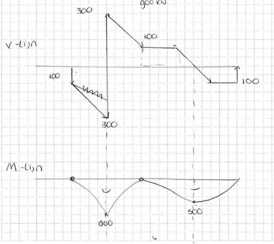

## 2.4 Draw the shear stress distribution just left of $\rm{C}$

### Wrong formula for $\tau$


## 2.5 Determine the displacement at $\rm{S}_2$

## 2.6 Sketch the displaced structure without values

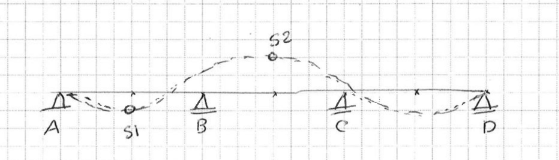